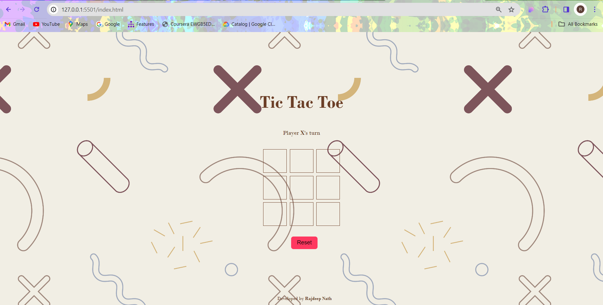

# PRODIGY_WD_03
# Tic Tac Toe

A simple Tic Tac Toe game developed by Rajdeep Nath.

## Table of Contents
- [Introduction](#introduction)
- [Features](#features)
- [Usage](#usage)
- [Screenshots](#screenshots)
- [Contributing](#contributing)
- [License](#license)

## Introduction
Tic Tac Toe is a classic game built using HTML, CSS, and JavaScript. It allows two players to take turns marking spaces in a 3x3 grid. The game announces the winner when a player forms a horizontal, vertical, or diagonal line with their marker.

## Features
- Play Tic Tac Toe against another player.
- Responsive design for various screen sizes.
- Announces the winner or declares a tie when the game ends.

## Usage
1. Open the `index.html` file in a web browser.
2. Click on the grid tiles to place your marker (X or O).
3. The game announces the winner or declares a tie when the game ends.
4. Click the "Reset" button to start a new game.

## Screenshots

## Contributing
If you'd like to contribute to this project, feel free to open issues or submit pull requests. Contributions are always welcome!

## License
This project is licensed under the [MIT License].

---

**Developed by Rajdeep Nath**
